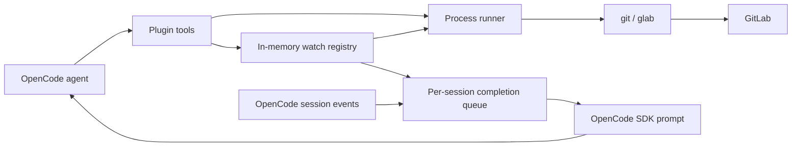
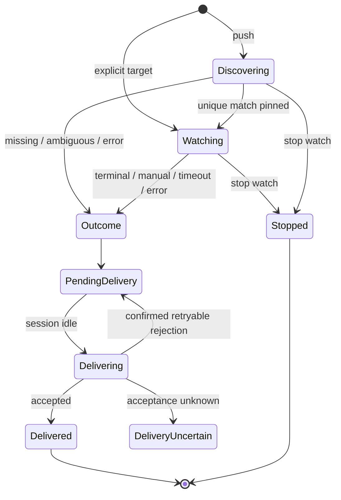

# GitLab Background Operations - Plan

## Goal Capsule

Build an OpenCode plugin that handles GitLab operations with compact tool output and watches pipelines or jobs in the background. Completion wakes the originating agent without agent-written polling loops.

Authority: the agreed conversation scope, then this plan, then verified CLI and SDK behavior. Preserve the user's preferences for `glab`, native waiting where suitable, background execution, in-memory watches, and automatic continuation.

Start with an OpenCode lifecycle smoke test before building the full workflow. Stop if the supported OpenCode release cannot deliver background results without aborting active work or cannot clean up plugin-owned subprocesses. Resolve these compatibility issues before expanding implementation.

Completion means locally verified code, tests, packaging, and usage documentation. Committing, pushing this plugin repository, publishing a package, and opening a PR require separate user direction. GitLab operations performed by the finished plugin remain subject to the invoking session's permissions and task instructions.

---

## Product Contract

### Summary

Expose a small tool surface for general GitLab operations plus optimized push, inspect, watch, and log retrieval workflows. Reuse existing CLI authentication. Keep repetitive status checks and streamed logs out of model context.

### Problem Frame

Agents currently orchestrate GitLab through repeated commands, guessed `sleep` durations, and oversized status or trace output. This consumes tokens, blocks useful work, and can associate success with the wrong commit.

The primary actor is an OpenCode agent acting for a developer. GitLab remains the authority for pipeline and job status; OpenCode remains the authority for agent permissions and session lifecycle.

### Requirements

#### GitLab operations

- **R1. General access:** provide a noninteractive `glab` execution tool covering GitLab commands and `glab api`, including merge requests, issues, pipeline/job inspection, retries, and cancellation. Do not require a separate typed wrapper for every GitLab feature.
- **R2. Push workflow:** provide a focused code-push operation that records the exact pushed SHA and starts background pipeline discovery. Report push success separately from CI success. Local commit preparation uses OpenCode's existing Git workflow; MR creation and updates use general `glab` access.
- **R3. Explicit targets:** inspect or watch a pipeline/job supplied as a GitLab URL or ID with project context. Support GitLab.com and self-managed hosts, including nested namespaces and repositories outside the current directory.

#### Background monitoring

- **R4. Nonblocking start:** return an acknowledgment containing a watch ID and resolved target without awaiting CI completion. Pipeline discovery after a push is also background work.
- **R5. Owned waiting:** prefer native `glab` waiting when it preserves target identity and status semantics. Otherwise schedule exact-target checks inside the plugin. Never ask the model to choose a sleep interval or run a shell polling loop.
- **R6. Exact identity:** pin a resolved watch to host, project, target type, and target ID. A newer branch pipeline or retried job must not silently replace the watched target.
- **R7. Result semantics:** distinguish success, failure, canceled, skipped, manual action required, missing pipeline, timeout, and monitoring errors. Preserve GitLab's raw status. Only explicit GitLab success confirms success.
- **R8. Automatic continuation:** deliver a compact result to the originating session and wake its agent. Queue delivery while that session is busy; do not abort an active tool call. Deduplicate completion delivery within the running instance.
- **R9. Runtime lifetime:** keep watches in memory. Support listing, inspecting, and stopping a watch. Plugin disposal and session deletion clean up owned resources. Stopping monitoring never cancels GitLab work; GitLab cancellation is a separate operation.

#### Token efficiency

- **R10. Bounded output:** keep normal acknowledgments and successful results small. Summarize failures with job names and links; retrieve bounded trace excerpts only when requested. General command output must indicate truncation and offer bounded follow-up reads.
- **R11. No monitoring turns:** starting a watch produces one acknowledgment; monitoring produces no model-visible progress messages; completion produces one logical result notification. Watching must not cause repeated agent invocations before an outcome exists.

### Key Flows and Acceptance Examples

- **F1 / AE1. Push:** after the agent prepares a commit, push SHA A and start discovery. A pipeline for SHA B appears later. The watch reports only the selected pipeline for A, or a clear discovery outcome; it never reports B as proof for A.
- **F2 / AE2. Referenced run:** watch a job URL on a self-managed host while the agent edits code. When the job fails, queue its result until the session is idle, then wake that session once with the job ID, failure state, and URL.
- **F3 / AE3. General operation:** update an MR description through the general tool. Execute once using existing `glab` credentials and return a bounded result. An ambiguous network failure must not automatically repeat the mutation.
- **F4 / AE4. Stop watch:** stop a pending watch. Its subprocess and timers end, while the GitLab pipeline continues. Restarting OpenCode creates no restored watch.

### Scope Boundaries

The first version includes general noninteractive CLI access, not a reimplementation of the entire `glab` command catalog. Commands that require an editor, browser, or interactive selector return a clear requirement for explicit noninteractive arguments. Artifact commands may write files; binary data does not belong in text tool output.

Deferred: restart recovery, a daemon or webhook service, automatic repair/retry policy, and recursive downstream-pipeline success aggregation. A pipeline result means that specific pipeline's status, not every deployment or downstream pipeline in the project.

---

## Planning Contract

### Grounding

The project directory was empty and is not a Git repository. There are no existing build, test, lint, dependencies, or local implementation patterns to preserve.

Verified against installed `glab` **1.115.0** and its tagged source:

- `ci status --wait` cannot accept an exact pipeline ID or JSON output. Its live loop re-resolves the branch and can follow another pipeline. Its exit code does not distinguish all terminal states.
- `ci get --pipeline-id` supports JSON inspection. `glab api` supports explicit host routing and GitLab REST endpoints.
- `ci trace <job-id>` polls the exact job internally at a three-second cadence. Its source waits indefinitely on manual jobs, does not terminate explicitly on skipped jobs, and returns normally for both success and failure. A trace process exit is not proof of job success.
- OpenCode's current plugin types expose session-aware tools, `context.ask`, events, and `dispose`. The SDK documents `session.prompt`, including context-only insertion with `noReply`. Published-release compatibility and busy-session races need runtime proof in U1.

### Key Technical Decisions

- **KTD1. CLI boundary:** all GitLab requests go through `glab`; pushes use `git`. Reuse CLI host configuration and credentials. This carries forward the user-directed CLI preference. Spawn executable plus argument arrays, not shell command strings.
- **KTD2. Background lifecycle:** an in-memory watch registry owns cancellation and delivery state. (session-settled: user-directed — chosen over a blocking tool call and restart-persistent service: background work is preferred, and running-instance lifetime is sufficient.)
- **KTD3. Delivery:** keep completion results pending while a session is busy; send a synthetic SDK prompt to the originating session when idle. (session-settled: user-approved — chosen over notification-only behavior: the agent should finish the task without another user message.) Verify release-specific prompt behavior before relying on it.
- **KTD4. Waiting strategy:** do not use `ci status --wait` for exact pipeline watches. Use exact-ID `glab api` checks with a cancellable internal scheduler. Use native exact-job tracing for active jobs where its behavior is suitable, followed by an authoritative job lookup; use status checks for trace-unavailable or unsupported lifecycle cases.
- **KTD5. Small tool surface:** use five tools: `gitlab`, `gitlab_push`, `gitlab_inspect`, `gitlab_watch`, and `gitlab_output`. Watch management is an action on `gitlab_watch`; trace access is a bounded action on `gitlab_output`. Avoid expanding tool schemas with the entire GitLab API.
- **KTD6. Runtime and packaging:** propose TypeScript ESM with `@opencode-ai/plugin`, Bun's test runner/build, TypeScript type checking, and Prettier. Resolve and pin versions compatible with the installed OpenCode release during U1; obtain approval before introducing dependencies. No GitLab SDK, queue package, or service is needed.

### High-Level Technical Design



Separate remote outcome from notification state:



### Target Resolution and Push Semantics

Resolve host/project once, using explicit input before the current repository context. Normalize numeric IDs and GitLab URLs; retain fully qualified identity in every result. Reject missing context instead of guessing a host for a bare ID. Encode project paths correctly for REST endpoints.

For push, capture the current branch and commit; push that captured SHA to an explicit branch ref so a concurrent local HEAD change cannot change what is sent. Resolve the destination project's identity from the push remote, not a possibly different fetch remote. Reject detached HEAD without an explicit destination. Preserve normal Git push rejection and permission behavior.

Discover pipelines by pushed SHA and ref, including appropriate MR pipeline lookup when MR context is supplied. Resolve to one candidate only when unambiguous. If multiple pipeline sources match, return candidate IDs/URLs for explicit selection rather than guess. Account for delayed pipeline creation; missing CI after the discovery deadline is not success. Merged-result pipelines may use a synthetic SHA: report that distinction and require explicit pipeline selection when association with the pushed SHA cannot be proved.

### Monitoring Policy

Use immediate observation followed by plugin-owned timers, never a spawned `sleep` process. Proposed initial defaults: three-second exact-ID checks, a two-minute discovery deadline, a 30-minute watch deadline, and a 30-second per-request timeout. Expose an optional total watch deadline, not a model-selected polling interval. These are centralized implementation defaults, not timing-dependent completion conditions.

Honor server retry guidance when available; apply bounded backoff for transient read failures and rate limiting within the remaining deadline. Authentication/authorization errors terminate promptly. Never retry arbitrary mutations automatically. Do not overlap checks for the same watch.

Preflight job state before starting native tracing. Already terminal or manual jobs finish immediately without tracing. Drain captured trace output with bounded storage. After trace exit, re-fetch the exact job. If tracing fails while the API still reports an active job, fall back to status checks; at the watch deadline, recheck authoritative state before returning timeout so skipped/manual states are represented correctly. Test these native CLI limitations explicitly.

Pipeline success follows the pipeline's own status, including allowed-failure jobs. Fetch failed-job metadata only on failure, paginating without dumping every job into context. Keep optional manual jobs distinct from a pipeline whose overall state is blocked/manual. Preserve unknown statuses and return an unsupported-state monitoring result rather than assuming success.

### Notification and Resource Ownership

Each watch stores its originating session, directory, agent context, target identity, deadline, latest observation, process controller, and delivery state. Identical starts in the same session reuse an active watch; separate sessions own separate subscriptions. Bound completed-result retention and total active watches; reject excess starts explicitly rather than silently evict active work.

Register session event handling before watches start. On completion, enqueue, reconcile actual session status, and drain only at idle with a per-session single-flight guard. Handle completion-before-acknowledgment so the originating tool finishes before a continuation prompt is sent. Multiple results already pending may share one prompt, with each watch result included once.

Use a stable message ID when the verified SDK supports retry-safe insertion. After uncertain acceptance, reconcile that ID before retrying. If acceptance cannot be established, retain `delivery_uncertain` for explicit inspection rather than blindly duplicate a wake-up. Do not await the agent's full response inside an event handler. Do not claim network-level exactly-once delivery without proof.

Plugin disposal and session deletion stop children, timers, and queued delivery. Closing a client attached to a shared OpenCode server may leave that server running: document that watch lifetime follows the plugin/server instance, not merely the visible terminal window. Explicit watch stop remains available.

### Output and Permissions

Return deterministic summaries without a second model: identity, outcome/raw status, URL, short timing information, and failed job references. Proposed limits: acknowledgment/success at most 1 KiB; failure/inspection summaries at most 4 KiB; general output and trace excerpts at most 8 KiB per read. Include explicit omission counts or truncation flags.

`gitlab_output` accepts a result reference plus offset/limit, or an exact job target for trace retrieval. Keep bounded command output in a per-instance cache (proposed 1 MiB per result, 16 MiB total); distinguish retained data from discarded overflow. Never claim a discarded full log is available locally. Raw job traces can be fetched again through GitLab. Strip terminal control sequences and keep command errors distinct from CI failures.

Route subprocess execution through OpenCode's permission mechanism before dispatch, preserving deny/ask/allow semantics for the actual operation. Background reads operate within the authorized watch target. General CLI execution must not become a shell escape or silently bypass session permissions. Capture stdout/stderr without inheriting a terminal; prevent editor/pager prompts, and require explicit arguments where commands would otherwise prompt. Provide stdin input for long MR descriptions/API bodies.

### Assumptions and Execution-Time Questions

- General GitLab coverage means noninteractive CLI/API capability, not bespoke schemas for every command. Local staging/commit creation remains with existing OpenCode Git tools; it is not a remote GitLab operation.
- Version selection and dependency approval happen at implementation setup. Current upstream types are evidence of an available direction, not proof that the installed release supports it.
- U1 must prove session wake-up, busy-session reconciliation, cancellation, and disposal. If the SDK cannot uphold those contracts, pause implementation for a compatibility decision rather than downgrade to blocking waits.
- Publishing and real GitLab test-project selection are deferred until explicitly requested. Fixture tests are always available; a live smoke test needs an authorized project and credentials.

---

## Output Structure

```text
package.json
bun.lock
tsconfig.json
README.md
src/
  index.ts
  process.ts
  gitlab.ts
  watches.ts
  delivery.ts
tests/
  plugin.test.ts
  process.test.ts
  gitlab.test.ts
  watches.test.ts
  delivery.test.ts
docs/plans/
  2026-09-13-001-feat-gitlab-background-operations-plan.md
```

Keep single-use parsing and formatting logic in its owning module. Split modules further only if implementation reveals an actual reuse or clarity need.

---

## Implementation Units

### U1. Establish Plugin and Lifecycle Compatibility

**Goal:** prove the background-to-session path before implementing GitLab workflows.

**Traces:** R4, R8, R9; KTD2, KTD3, KTD6. **Dependencies:** none.

**Files:** `package.json`, `bun.lock`, `tsconfig.json`, `src/index.ts`, `src/delivery.ts`, `tests/plugin.test.ts`, `tests/delivery.test.ts`.

Use the official typed plugin/tool pattern. Record the installed OpenCode/Bun versions, choose compatible dependencies with approval, and establish test/build/typecheck/format scripts. Implement the minimal queue and lifecycle integration as production code with a fake completion source in tests.

**Test scenarios:** (1) Idle session receives a result and resumes once. (2) A result arriving during an active tool waits without aborting it. (3) Completion racing tool acknowledgment is delivered after the acknowledgment. (4) Session deletion or plugin disposal prevents pending wake-ups and releases resources. (5) A rejected prompt remains pending; uncertain acceptance is reconciled without duplicate insertion. (6) Active-session changes preserve originating session routing and appropriate agent context.

**Verification:** automated delivery tests plus a real OpenCode smoke test against the supported release. Record observed SDK/event behavior in `README.md`; remove throwaway spike code. Failure of the lifecycle contract blocks dependent units.

### U2. Implement the CLI Boundary and Bounded Output

**Goal:** provide general GitLab operations without unbounded context or command ambiguity.

**Traces:** R1, R3, R10; KTD1, KTD5. **Dependencies:** U1.

**Files:** `src/process.ts`, `src/gitlab.ts`, `src/index.ts`, `tests/process.test.ts`, `tests/gitlab.test.ts`.

Build a cancellable argv-based process runner and bounded output cache. Register `gitlab` and `gitlab_output` with explicit working-directory/host context, stdin support, exit status, and OpenCode permission integration. Prefer JSON for known structured reads; preserve bounded text for general commands.

**Test scenarios:** (1) MR body containing quotes, backticks, and newlines is passed literally. (2) Permission denial executes nothing. (3) Missing executable, missing login, and request failure remain distinct errors. (4) Oversized stdout/stderr stays within cache and response limits with accurate truncation metadata. (5) Timeout/abort terminates children. (6) Two hosts with the same project/ID do not collide. (7) Mutating command with ambiguous failure executes once. (8) Follow-up output reads honor offsets and report eviction or discarded overflow.

**Verification:** fake executable fixtures exercise process behavior without GitLab credentials; confirm no command string is interpreted by a shell.

### U3. Resolve Targets and Start Push Discovery

**Goal:** correctly associate work with a remote pipeline/job.

**Traces:** R2, R3, R4, R6; KTD1, KTD5. **Dependencies:** U2.

**Files:** `src/gitlab.ts`, `src/index.ts`, `tests/gitlab.test.ts`, `tests/plugin.test.ts`.

Register `gitlab_inspect` and `gitlab_push`. Normalize URLs and IDs; resolve explicit host/project and Git push destinations. Capture/push the chosen SHA, then hand discovery to an injected watch registry interface, using a fake registry for U3 verification until U4 supplies the implementation. Handle branch and MR associations without treating a synthetic merge SHA as the original commit.

**Test scenarios:** (1) Nested-namespace URL resolves on the named host. (2) Bare ID without project context fails clearly. (3) Push rejection starts no watch. (4) Local HEAD changes during push but captured SHA is the refspec source. (5) Different push/fetch remotes select the push destination. (6) Successful push hands the captured SHA, ref, destination project, and supplied MR context to the fake registry without awaiting discovery. (7) MR-only, fork, and merged-result cases never silently assert an unproved SHA association.

**Verification:** fixture-backed target tests and a temporary local bare Git remote for exact push behavior. No real remote mutation is needed for automated tests.

### U4. Implement Exact Background Watches

**Goal:** monitor without model turns and classify every outcome explicitly.

**Traces:** R4-R7, R9, R11; KTD2, KTD4, KTD5. **Dependencies:** U2, U3.

**Files:** `src/watches.ts`, `src/gitlab.ts`, `src/index.ts`, `tests/watches.test.ts`.

Register `gitlab_watch` start/list/get/stop actions. Implement discovery, pinned identities, deadlines, native-job tracing, exact-pipeline checks, and stop/disposal ownership. Inject clock and process behavior for deterministic tests instead of real waiting.

**Test scenarios:** (1) Start acknowledges before remote completion. (2) Pending-to-running-to-success emits no intermediate model output. (3) Newer branch pipeline and retried job do not replace the target. (4) Failed/canceled/skipped/manual/unknown states are distinct. (5) Trace exit zero on failed job still reports failure. (6) Trace failure or missing trace falls back to authoritative status; skipped/manual trace limitations cannot produce false success. (7) Rate limiting and transient read errors back off within deadline; auth failure terminates. (8) Duplicate starts reuse the same session watch, while other sessions remain isolated. (9) Stopping monitoring kills local work without invoking GitLab cancellation. (10) Capacity/deadline/disposal paths leave no orphan children or timers.

**Discovery scenarios:** (1) Delayed matching pipeline is selected; newer wrong-SHA pipeline is ignored. (2) Multiple matches return candidates. (3) Missing CI reaches discovery deadline.

**Verification:** fake-clock tests complete without real sleeps; assert exact request identities and bounded request counts.

### U5. Integrate Delivery, Packaging, and Workflow Proof

**Goal:** deliver a usable plugin with verified token-efficient behavior.

**Traces:** R1-R11, AE1-AE4; KTD1-KTD6. **Dependencies:** U1-U4.

**Files:** `src/index.ts`, `src/delivery.ts`, `src/watches.ts`, `tests/plugin.test.ts`, `tests/delivery.test.ts`, `package.json`, `README.md`.

Wire outcomes to the session queue, bounded summaries, and on-demand failed-job traces. Keep tool descriptions concise and explain that a started watch resumes automatically. Document installation, supported versions, CLI authentication, tools, watch lifetime, manual states, output limits, and the verified `glab` limitations.

**Test scenarios:** (1) Complete push-to-success fixture produces one acknowledgment and one logical result. (2) Failure produces bounded metadata; trace excerpts are returned to the agent only on demand. Native tracing used for monitoring drains output with bounded storage and emits no model-visible progress. (3) Concurrent completions are serialized or batched without dropped/duplicate results. (4) Idle events caused by a delivered result do not cause a notification loop. (5) Deleted sessions never receive a result intended for another session. (6) Built package imports and registers tools in a fresh OpenCode instance. (7) User stop/disposal during an in-flight check prevents later delivery. (8) Busy/idle reconciliation races do not abort user work.

**Verification:** run all feature tests once, package build/import smoke, and lifecycle smoke against the pinned OpenCode release. If an authorized GitLab test project is available, verify one pipeline watch and one job watch live; otherwise explicitly record that live GitLab integration remains unverified.

---

## Verification Contract

Proposed scripts, to be established in U1 because the project has none:

- `bun run typecheck`: strict TypeScript checking.
- `bun test`: deterministic process, target, watch, delivery, and plugin integration tests.
- `bun run build`: produce the package ESM entrypoint and verify exported plugin types.
- `bun run lint`: TypeScript static checks plus Prettier check; avoid another lint dependency for the initial small codebase.
- `bun run format`: Prettier formatting; generated Markdown uses Prettier defaults.

Use targeted test files during each unit and all plugin tests at final integration. No real sleep-based tests. Measure model-visible byte counts and message counts, not estimated token savings: an acknowledgment/success is at most 1 KiB, failure/inspection at most 4 KiB, trace/general reads at most 8 KiB, and no intermediate polling messages reach the model.

The runtime smoke must exercise the supported OpenCode release, an active tool, an idle session, and cleanup. Mocks alone cannot prove session concurrency behavior. Live GitLab smoke is a separately reported environment-dependent check; never report fixtures as live CI verification.

---

## Definition of Done

All R-IDs and acceptance examples map to implemented tool behavior and tests. Each unit satisfies its stated verification and all final static checks/build/tests pass. The runtime smoke proves automatic continuation without interrupting work. Output and retained-memory limits hold under large traces and concurrent watches.

Documentation names supported CLI/OpenCode versions, install steps, runtime lifetime, exact-ID semantics, watch cancellation versus remote cancellation, and any live-integration validation still outstanding. Package exports load correctly. Remove temporary probes, unused code introduced by the implementation, and unneeded dependencies.

---

## Sources

- [OpenCode plugins](https://opencode.ai/docs/plugins/) and [SDK](https://opencode.ai/docs/sdk/), consulted 2026-09-13.
- [OpenCode plugin types](https://github.com/anomalyco/opencode/blob/dev/packages/plugin/src/index.ts) and [tool context](https://github.com/anomalyco/opencode/blob/dev/packages/plugin/src/tool.ts); moving upstream references, to be checked against the chosen package release in U1.
- [OpenCode session prompt implementation](https://github.com/anomalyco/opencode/blob/dev/packages/opencode/src/session/prompt.ts); distinguishes context insertion from starting the session loop.
- [glab v1.115.0 pipeline status](https://gitlab.com/gitlab-org/cli/-/blob/v1.115.0/internal/commands/ci/status/status.go); branch re-resolution and terminal-state exit behavior.
- [glab v1.115.0 CI utilities](https://gitlab.com/gitlab-org/cli/-/blob/v1.115.0/internal/commands/ci/ciutils/utils.go); exact-job trace polling and state limitations.
- Installed CLI help for `glab ci status`, `glab ci get`, `glab ci trace`, and `glab api`.
